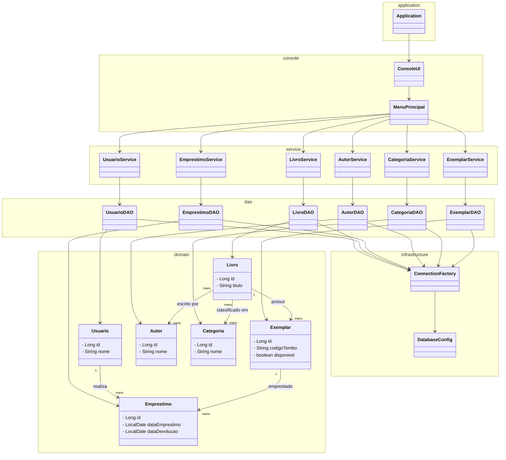

## 📑 Sumário

- [🛠️ Setup do Ambiente — Aulas de Banco de Dados com Java](#️-setup-do-ambiente--aulas-de-banco-de-dados-com-java)
  - [✅ 1️⃣ Instalar o Java 21](#️-1️⃣-instalar-o-java-21)
  - [✅ 2️⃣ Instalar o Eclipse IDE](#️-2️⃣-instalar-o-eclipse-ide)
  - [✅ 3️⃣ Instalar o PostgreSQL](#️-3️⃣-instalar-o-postgresql)
  - [✅ 4️⃣ Instalar o DBeaver](#️-4️⃣-instalar-o-dbeaver)
  - [🔌 5️⃣ Configurar Conexão no DBeaver](#-5️⃣-configurar-conexão-no-dbeaver)
  - [🧪 6️⃣ Testar o PostgreSQL](#-6️⃣-testar-o-postgresql)
  - [☕ 7️⃣ JDBC no Eclipse](#-7️⃣-jdbc-no-eclipse-importante-para-as-próximas-aulas)
  - [🎯 Ambiente pronto!](#-ambiente-pronto)
  - [❓ Problemas comuns](#-problemas-comuns)
  - [👍 Pronto para começar!](#-pronto-para-começar)
- [Criando um Projeto Maven no Eclipse](#criando-um-projeto-maven-no-eclipse)
- [📚 Projeto — Sistema de Gerenciamento de Biblioteca (Console + JDBC)](#-projeto--sistema-de-gerenciamento-de-biblioteca-console--jdbc)
  - [🎯 Objetivo Geral](#-objetivo-geral)
  - [🧱 Arquitetura do Projeto](#-arquitetura-do-projeto)
    - [🖥 Camada de Aplicação (app)](#-camada-de-aplicação-app)
    - [🧠 Camada de Serviços (service)](#-camada-de-serviços-service)
    - [💾 Camada de Persistência (dao)](#-camada-de-persistência-dao)
    - [🗄 Camada de Conexão (db)](#-camada-de-conexão-db)
  - [🗺 Diagrama da Estrutura do Projeto](#-diagrama-da-estrutura-do-projeto)
  - [📦 Dependências do Projeto](#-dependências-do-projeto)
- [🧩 API JDBC — Principais Interfaces e Classes](#-api-jdbc--principais-interfaces-e-classes)


# 🛠️ Setup do Ambiente — Aulas de Banco de Dados com Java

Este guia orienta a configuração do ambiente necessário para as nossas aulas iniciais.  
Vamos utilizar:

- **Java 21**
- **Eclipse IDE**
- **PostgreSQL**
- **DBeaver**

---

## ✅ 1️⃣ Instalar o Java 21

### 🔹 Verifique se já possui Java instalado
Abra o terminal / prompt de comando e execute:

```bash
java -version
```

Se aparecer **Java 21**, você já está pronto.  
Se não aparecer ou estiver em versão inferior, instale:

### 🔹 Download
Baixe o **JDK 21 (LTS)** em:

- https://jdk.java.net/21/  
ou  
- https://www.oracle.com/java/technologies/downloads/

Instale normalmente.

### 🔹 Verifique após instalar
```bash
java -version
```

---

## ✅ 2️⃣ Instalar o Eclipse IDE

Baixe o Eclipse em:

- https://www.eclipse.org/downloads/

Recomendado:
> **Eclipse IDE for Java Developers**

Após baixar:
- Instale ou extraia
- Abra o Eclipse
- Escolha um workspace (pasta de projetos)

Pronto! ✔️

---

## ✅ 3️⃣ Instalar o PostgreSQL

Baixe o PostgreSQL em:

- https://www.postgresql.org/download/

Durante a instalação:
1. Defina uma senha para o usuário **postgres** → guarde essa senha

Após instalar, verifique:
- O PostgreSQL deve iniciar automaticamente
- Porta padrão: **5432**

---

## ✅ 4️⃣ Instalar o DBeaver

Baixe em:

- https://dbeaver.io/download/

Instale normalmente.

---

## 🔌 5️⃣ Configurar Conexão no DBeaver

1. Abra o **DBeaver**
2. Clique em **New Database Connection**
3. Selecione **PostgreSQL**
4. Preencha as informações:

| Campo        | Valor sugerido |
|--------------|----------------|
| Host         | localhost       |
| Port         | 5432            |
| Database     | postgres        |
| User         | postgres        |
| Password     | (senha definida na instalação) |

Clique em **Test Connection**  
Se estiver tudo OK → **Finish**

---

## 🧪 6️⃣ Testar o PostgreSQL

No DBeaver, execute:

```sql
SELECT version();
```

Se aparecer a versão do PostgreSQL → Banco funcionando! ✔️

---

## ☕ 7️⃣ JDBC no Eclipse (Importante para as próximas aulas)

Para conectar Java ao PostgreSQL será necessário o **driver JDBC**.

Quando criarmos o projeto Java no Eclipse:
1. Crie um projeto Java
2. Adicione o driver JDBC

Driver oficial:
https://jdbc.postgresql.org/

Nas próximas aulas também vamos ver como usar **Maven** para gerenciar dependências.

---

## 🎯 Ambiente pronto!

Se tudo estiver certo, você terá:
✔️ Java funcionando  
✔️ Eclipse instalado  
✔️ PostgreSQL ativo  
✔️ DBeaver conectado ao banco  

Nas próximas aulas vamos:
- Criar banco e tabelas
- Executar comandos SQL
- Integrar Java com PostgreSQL

---
# Criando um Projeto Maven no Eclipse

Este documento apresenta um **passo a passo completo para criar um projeto Maven no Eclipse**, ideal para aulas iniciais de Java e projetos introdutórios.

---

## 🧩 Pré-requisitos

Antes de começar, certifique-se de que você possui:

- **Java (JDK) instalado** (Java 17 ou Java 21)
- **Eclipse IDE**
  - Recomendado: *Eclipse IDE for Java Developers*
- **Maven**
  - O Eclipse já vem com Maven integrado (plugin *m2e*)

---

## 🚀 Passo a passo: Criando um projeto Maven no Eclipse

### 1️⃣ Abrir o Eclipse

Abra o Eclipse normalmente e selecione um **Workspace**, que é a pasta onde seus projetos ficarão armazenados.

---

### 2️⃣ Criar um novo projeto Maven

1. No menu superior, clique em:
   ```
   File → New → Other...
   ```
2. Na janela que será exibida:
   - Expanda a opção **Maven**
   - Selecione **Maven Project**
   - Clique em **Next**

---

### 3️⃣ Configurar o projeto Maven

1. Marque a opção:
   ```
   Create a simple project (skip archetype selection)
   ```
   Essa opção é recomendada para projetos simples ou aulas iniciais.
2. Clique em **Next**

---

### 4️⃣ Informar os dados do projeto

Preencha os campos conforme o exemplo abaixo:

- **Group Id**
  ```
  br.com.fuctura
  ```
  Representa a organização ou domínio do projeto.

- **Artifact Id**
  ```
  projeto-maven
  ```
  Nome do projeto / artefato.

- **Version**
  ```
  1.0-SNAPSHOT
  ```
  O sufixo `SNAPSHOT` indica que o projeto está em desenvolvimento.

- **Packaging**
  ```
  jar
  ```
  Utilizado para aplicações Java comuns.

- **Name** (opcional)
  ```
  Projeto Maven Exemplo
  ```

- **Description** (opcional)
  ```
  Projeto Maven para aulas de Java
  ```

Após preencher todos os campos, clique em **Finish**.

---

### 5️⃣ Estrutura padrão do projeto Maven

Após a criação, o Eclipse irá gerar automaticamente a seguinte estrutura:

```
projeto-maven
 ├── src/main/java
 ├── src/main/resources
 ├── src/test/java
 └── pom.xml
```

**Descrição das pastas:**

- `src/main/java` → Código-fonte principal da aplicação
- `src/main/resources` → Arquivos de configuração e recursos
- `src/test/java` → Código de testes
- `pom.xml` → Arquivo central de configuração do Maven

---

## 🛠️ Configurar a versão do Java no Maven

1. Abra o arquivo **pom.xml**
2. Adicione ou ajuste as propriedades abaixo:

```xml
<properties>
    <maven.compiler.source>21</maven.compiler.source>
    <maven.compiler.target>21</maven.compiler.target>
</properties>
```

Ajuste a versão do Java conforme o padrão adotado na aula ou no projeto.

---

## ▶️ Criar uma classe Java de teste

1. Clique com o botão direito em:
   ```
   src/main/java
   ```
2. Selecione:
   ```
   New → Class
   ```
3. Preencha os campos:
   - **Package**: `br.com.fuctura`
   - **Name**: `Main`

Exemplo de código:

```java
public class Main {
    public static void main(String[] args) {
        System.out.println("Projeto Maven funcionando!");
    }
}
```

---

## 📦 Atualizar dependências Maven

Caso o projeto apresente erros ou dependências não resolvidas:

1. Clique com o botão direito no projeto
2. Selecione:
   ```
   Maven → Update Project
   ```
3. Clique em **OK**

---

## ✅ Conclusão

O projeto Maven está corretamente configurado e pronto para:

- Adicionar dependências no arquivo `pom.xml`
- Trabalhar com JDBC, JPA, Spring e outras bibliotecas
- Gerar builds utilizando o comando:
  ```
  mvn package
  ```
---

## ❓ Problemas comuns

### 🔸 Erro ao conectar no DBeaver
- Verifique se o PostgreSQL está em execução
- Verifique host, porta, usuário e senha
- Verifique firewall

### 🔸 `java: command not found`
- Java não instalado
- Variáveis de ambiente não configuradas corretamente

---

## 👍 Pronto para começar!

Qualquer dúvida, traga para aula 😊


# 📚 Projeto — Sistema de Gerenciamento de Biblioteca (Console + JDBC)

Este projeto será desenvolvido ao longo das aulas para simular um sistema de gerenciamento de biblioteca.
Nosso objetivo é trabalhar conceitos de **arquitetura em camadas**, **JDBC**, **DAO**, **boas práticas de separação de responsabilidades** e acesso a banco de dados.

---

## 🎯 Objetivo Geral

Criar uma aplicação console em Java que permita:

- Gerenciar livros
- Gerenciar usuários
- Controlar empréstimos
- Persistir tudo em um banco PostgreSQL via JDBC

---

## 🧩 Estrutura Conceitual

O projeto foi planejado a partir de dois pilares principais:

### 🔷 1️⃣ Modelo Conceitual – ER (Entidade-Relacionamento)

O sistema contempla as seguintes entidades principais:

- **Livro** – Representa a obra em si (título, descrição, associação com autor e categoria).
- **Autor** – Armazena informações sobre os autores cadastrados.
- **Categoria** – Permite organização temática dos livros.
- **Exemplar** – Representa cada cópia física disponível de um livro.
- **Usuário** – Representa a pessoa que realiza empréstimos.
- **Empréstimo** – Controla o processo de retirada e devolução dos exemplares.

Além disso, o modelo prevê funcionalidades como:
- Associação de livros a autores  
- Classificação dos livros em categorias  
- Controle por exemplares, permitindo múltiplas cópias do mesmo livro  
- Relacionamento entre usuários e empréstimos  

---

### 🧱 Diagrama ER

```mermaid
erDiagram
    USUARIO {
        LONG id
        STRING nome
    }

    LIVRO {
        LONG id
        STRING titulo
    }

    EXEMPLAR {
        LONG id
        STRING codigoTombo
        BOOLEAN disponivel
    }

    AUTOR {
        LONG id
        STRING nome
    }

    CATEGORIA {
        LONG id
        STRING nome
    }

    EMPRESTIMO {
        LONG id
        DATE dataEmprestimo
        DATE dataDevolucao
    }

    LIVRO_AUTOR {
        LONG id
    }

    LIVRO_CATEGORIA {
        LONG id
    }

    %% ================= RELACIONAMENTOS =================

    %% Usuário realiza empréstimos
    USUARIO ||--o{ EMPRESTIMO : realiza

    %% Empréstimo feito sobre EXEMPLAR (não mais diretamente no livro)
    EXEMPLAR ||--o{ EMPRESTIMO : emprestado

    %% Livro possui vários exemplares
    LIVRO ||--o{ EXEMPLAR : possui

    %% Livro x Autor (N:N)
    LIVRO ||--o{ LIVRO_AUTOR : contem
    AUTOR ||--o{ LIVRO_AUTOR : escreve

    %% Livro x Categoria (N:N)
    LIVRO ||--o{ LIVRO_CATEGORIA : classifica
    CATEGORIA ||--o{ LIVRO_CATEGORIA : pertence
```



## 🧱 Arquitetura do Projeto

Adotaremos uma arquitetura organizada em camadas:

### 🖥 Camada de Aplicação (`app`)
Responsável por iniciar o sistema e controlar o fluxo via menu:
- `Application` → contém o `main`
- `ConsoleMenu` → interação com o usuário via terminal

---

### 🧠 Camada de Serviços (`service`)
Contém as regras de negócio do sistema:

- `LivroService`
- `UsuarioService`
- `EmprestimoService`
- `AutorService`
- `CategoriaService`
- `ExemplarService`

Nenhum serviço acessa banco diretamente — isso é função do DAO.

---

### 💾 Camada de Persistência (`dao`)
Responsável por conversar com o banco de dados usando JDBC:

- `LivroDAO`
- `UsuarioDAO`
- `EmprestimoDAO`
- `AutorDAO`
- `CategoriaDAO`
- `ExemplarDAO`

Cada DAO contém operações como salvar, listar, buscar etc.

---

### 🗄 Camada de Infra (`db`)
Centraliza a criação da conexão com o banco:

- `ConnectionFactory`
- `DatabaseConfig`

---

## 🗺 Diagrama da Estrutura do Projeto

O diagrama abaixo representa visualmente a organização do sistema:



---
- domain = modelo do mundo real

- service = regras de negócio

- dao = persistência / JDBC

- infrastructure = detalhes técnicos (conexão, config)

- console = interface com usuário

## 📦 Dependências do Projeto

O projeto utilizará **Maven** para gerenciamento de dependências.  
Certifique-se de que o arquivo `pom.xml` contenha as seguintes bibliotecas:

### 🗄️ Driver JDBC do PostgreSQL
Responsável por permitir a comunicação entre o Java e o banco PostgreSQL.

```xml
<dependency>
    <groupId>org.postgresql</groupId>
    <artifactId>postgresql</artifactId>
    <version>42.7.3</version>
</dependency>
```

### ⌨️ JLine – Interface de Console

Usaremos o JLine para criar menus mais amigáveis e melhorar a interação via terminal.

```xml
<dependency>
    <groupId>org.jline</groupId>
    <artifactId>jline</artifactId>
    <version>3.26.0</version>
</dependency>
```

### ⌨️ Lombok

O **Lombok** é uma **biblioteca Java** que reduz drasticamente a **verbosidade do código**, gerando automaticamente código repetitivo **em tempo de compilação**.

📌 Ele elimina a necessidade de escrever manualmente:
- Getters e Setters
- Construtores
- `toString()`
- `equals()` e `hashCode()`
- Builders
- Logs

Tudo isso é feito por meio de **anotações**.

```xml
<!-- Source: https://mvnrepository.com/artifact/org.projectlombok/lombok -->
<dependency>
    <groupId>org.projectlombok</groupId>
    <artifactId>lombok</artifactId>
    <version>1.18.42</version>
    <scope>compile</scope>
</dependency>
```
---

### Snippet


```java
package br.com.fuctura;

import org.jline.reader.LineReader;
import org.jline.reader.LineReaderBuilder;
import org.jline.terminal.Terminal;
import org.jline.terminal.TerminalBuilder;

public class MenuPrincipal {

	private LineReader reader;

	public MenuPrincipal() throws Exception {
		Terminal terminal = TerminalBuilder.builder().system(true).build();
		reader = LineReaderBuilder.builder().terminal(terminal).build();
	}

	public void iniciar() {
		String opcao;

		do {
			System.out.println("\n====== 📚 SISTEMA DE BIBLIOTECA ======");
			System.out.println("1) Gerenciar Livros");
			System.out.println("2) Gerenciar Usuários");
			System.out.println("3) Registrar Empréstimo (futuro)");
			System.out.println("4) Registrar Devolução (futuro)");
			System.out.println("0) Sair");
			System.out.println("=====================================");

			opcao = reader.readLine("Selecione uma opção: ");

			switch (opcao) {
			case "1" -> menuLivros();
			case "2" -> menuUsuarios();
			case "3" -> System.out.println(">>> Empréstimo (a implementar)");
			case "4" -> System.out.println(">>> Devolução (a implementar)");
			case "0" -> System.out.println("Encerrando...");
			default -> System.out.println("Opção inválida!");
			}

		} while (!opcao.equals("0"));
	}

	private void menuLivros() {
		String opcao;

		do {
			System.out.println("\n------ MENU LIVROS ------");
			System.out.println("1) Cadastrar Livro");
			System.out.println("2) Listar Livros");
			System.out.println("3) Buscar Livro");
			System.out.println("0) Voltar");

			opcao = reader.readLine("Escolha: ");

			switch (opcao) {
			case "1" -> System.out.println("cadastrar...");
			case "2" -> System.out.println("b...");
			case "3" -> System.out.println("c...");
			case "0" -> System.out.println("Voltando...");
			default -> System.out.println("Opção inválida!");
			}

		} while (!opcao.equals("0"));
	}

	private void menuUsuarios() {
		String opcao;

		do {
			System.out.println("\n------ MENU USUÁRIOS ------");
			System.out.println("1) Cadastrar Usuário");
			System.out.println("2) Listar Usuários");
			System.out.println("0) Voltar");

			opcao = reader.readLine("Escolha: ");

			switch (opcao) {
			case "0" -> System.out.println("Voltando...");
			default -> System.out.println("Opção inválida!");
			}

		} while (!opcao.equals("0"));
	}
}
```

## 🧩 API JDBC — Principais Interfaces e Classes

A API JDBC é composta por um conjunto de **interfaces e classes fundamentais** que permitem a comunicação entre aplicações Java e bancos de dados relacionais.

Cada elemento da API possui um papel bem definido dentro do fluxo de acesso a dados.

---

## 🚦 `DriverManager`

O `DriverManager` é o **ponto central de gerenciamento dos drivers JDBC**.

### Funções principais:
- Localizar o driver JDBC apropriado
- Estabelecer conexões com o banco de dados
- Gerenciar múltiplos drivers registrados na JVM

📌 Normalmente, o driver é carregado automaticamente quando a dependência é adicionada ao projeto.

### Uso conceitual:
> “O `DriverManager` sabe qual driver usar com base na URL JDBC.”

---

## 🔗 `Connection`

A interface `Connection` representa uma **conexão ativa com o banco de dados**.

### Responsabilidades:
- Criar objetos `Statement` e `PreparedStatement`
- Controlar transações (`commit`, `rollback`)
- Definir modo de auto-commit
- Encerrar a comunicação com o banco

📌 Cada instância de `Connection` corresponde a uma sessão aberta no banco.

⚠️ Conexões devem ser sempre fechadas após o uso.

---

## 📝 `Statement`

O `Statement` é usado para executar comandos SQL **estáticos**, sem parâmetros.

### Características:
- Executa SQL diretamente
- Indicado apenas para testes ou comandos simples
- Não protege contra SQL Injection

📌 Seu uso é **desencorajado em sistemas reais**.

---

## 🔐 `PreparedStatement`

O `PreparedStatement` é uma versão mais segura e eficiente do `Statement`.

### Vantagens:
- Suporte a parâmetros
- Prevenção contra SQL Injection
- Melhor desempenho
- Reutilização de comandos

📌 É o tipo de comando **recomendado** para praticamente todos os casos.

Conceito importante:
> “O SQL é compilado uma vez, os dados são fornecidos separadamente.”

---

## 📊 `ResultSet`

O `ResultSet` representa o **conjunto de dados retornado por uma consulta SQL**.

### Características:
- Navegação linha a linha
- Acesso aos dados por nome ou índice da coluna
- Conversão automática de tipos SQL para Java

📌 O `ResultSet` funciona como um **cursor** sobre os dados.


## 📊 ResultSet — Conceitos, Funcionamento e Boas Práticas

O **`ResultSet`** é a interface da API JDBC que representa o **resultado de uma consulta SQL (`SELECT`)**.
Ele é responsável por disponibilizar, de forma controlada, os dados retornados pelo banco de dados para a aplicação Java.

Diferente de uma lista comum, o `ResultSet` **não carrega os dados como objetos Java prontos**.
Ele funciona como um **cursor** que percorre os registros retornados pelo banco.

---

## 🧠 Conceito fundamental: Cursor

Quando um `ResultSet` é criado:
- O cursor começa **antes da primeira linha**
- Nenhum dado está acessível ainda
- É obrigatório mover o cursor para acessar os dados

```java
ResultSet rs = ps.executeQuery();
// cursor está antes da primeira linha
```

📌 Somente após chamar next() o cursor aponta para uma linha válida.

---

▶️ Navegação básica

```java
while (rs.next()) { // leitura dos dados da linha atual } `
```

- `next()` move o cursor para a próxima linha

- Retorna `false` quando não há mais registros

📌 Esse é o padrão mais comum de uso.

---

## 🧾 `SQLException`

A classe `SQLException` representa **erros relacionados ao banco de dados**.

### Pode indicar:
- Erros de conexão
- Problemas de sintaxe SQL
- Violação de integridade
- Falhas de transação

📌 Sempre deve ser tratada ou propagada adequadamente.

---

## 🔄 Fluxo conceitual da API JDBC

1. `DriverManager` localiza o driver
2. Uma `Connection` é criada
3. Um `PreparedStatement` é preparado
4. O SQL é executado
5. O resultado é lido via `ResultSet`
6. Recursos são fechados

---

## 📚 Conclusão

A API JDBC oferece:
- Controle total sobre o acesso a dados
- Uma base sólida para compreender frameworks ORM
- Clareza sobre execução de SQL e transações

> “Entender a API JDBC é entender o coração do acesso a dados em Java.”
