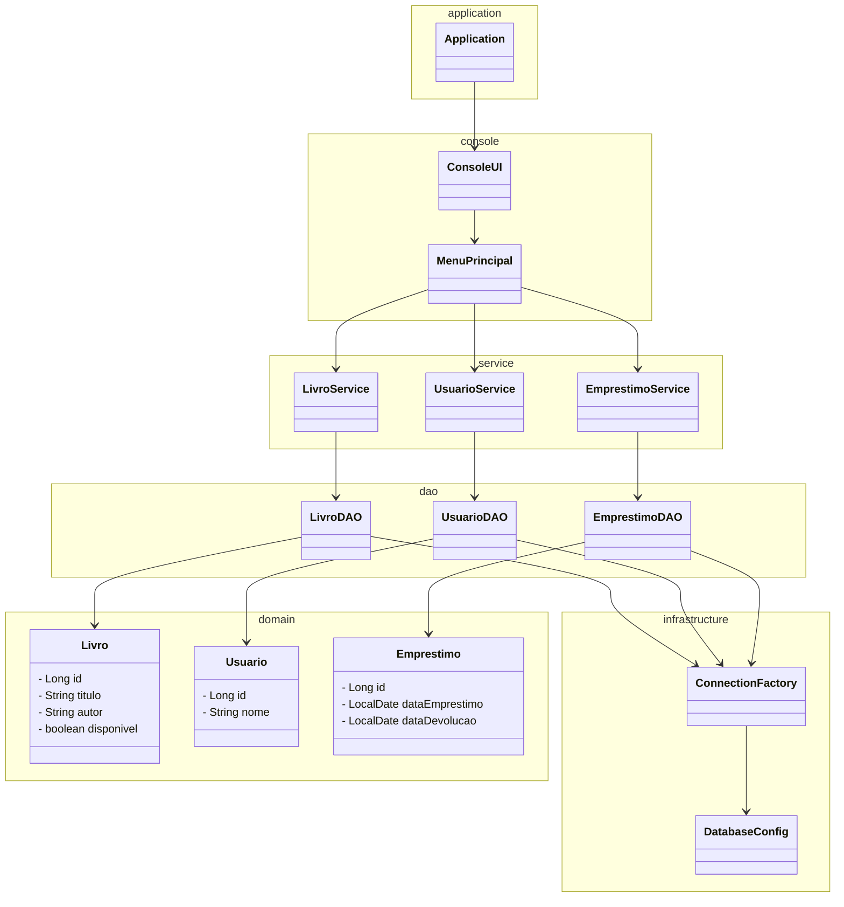

## 📑 Sumário

- [🛠️ Setup do Ambiente — Aulas de Banco de Dados com Java](#️-setup-do-ambiente--aulas-de-banco-de-dados-com-java)
  - [✅ 1️⃣ Instalar o Java 21](#️-1️⃣-instalar-o-java-21)
  - [✅ 2️⃣ Instalar o Eclipse IDE](#️-2️⃣-instalar-o-eclipse-ide)
  - [✅ 3️⃣ Instalar o PostgreSQL](#️-3️⃣-instalar-o-postgresql)
  - [✅ 4️⃣ Instalar o DBeaver](#️-4️⃣-instalar-o-dbeaver)
  - [🔌 5️⃣ Configurar Conexão no DBeaver](#-5️⃣-configurar-conexão-no-dbeaver)
  - [🧪 6️⃣ Testar o PostgreSQL](#-6️⃣-testar-o-postgresql)
  - [☕ 7️⃣ JDBC no Eclipse](#-7️⃣-jdbc-no-eclipse-importante-para-as-próximas-aulas)
  - [🎯 Ambiente pronto!](#-ambiente-pronto)
  - [❓ Problemas comuns](#-problemas-comuns)
  - [👍 Pronto para começar!](#-pronto-para-começar)

- [📚 Projeto — Sistema de Gerenciamento de Biblioteca (Console + JDBC)](#-projeto--sistema-de-gerenciamento-de-biblioteca-console--jdbc)
  - [🎯 Objetivo Geral](#-objetivo-geral)
  - [🧱 Arquitetura do Projeto](#-arquitetura-do-projeto)
    - [🖥 Camada de Aplicação (app)](#-camada-de-aplicação-app)
    - [🧠 Camada de Serviços (service)](#-camada-de-serviços-service)
    - [💾 Camada de Persistência (dao)](#-camada-de-persistência-dao)
    - [🗄 Camada de Conexão (db)](#-camada-de-conexão-db)
  - [🗺 Diagrama da Estrutura do Projeto](#-diagrama-da-estrutura-do-projeto)
  - [📦 Dependências do Projeto](#-dependências-do-projeto)


# 🛠️ Setup do Ambiente — Aulas de Banco de Dados com Java

Este guia orienta a configuração do ambiente necessário para as nossas aulas iniciais.  
Vamos utilizar:

- **Java 21**
- **Eclipse IDE**
- **PostgreSQL**
- **DBeaver**

---

## ✅ 1️⃣ Instalar o Java 21

### 🔹 Verifique se já possui Java instalado
Abra o terminal / prompt de comando e execute:

```bash
java -version
```

Se aparecer **Java 21**, você já está pronto.  
Se não aparecer ou estiver em versão inferior, instale:

### 🔹 Download
Baixe o **JDK 21 (LTS)** em:

- https://jdk.java.net/21/  
ou  
- https://www.oracle.com/java/technologies/downloads/

Instale normalmente.

### 🔹 Verifique após instalar
```bash
java -version
```

---

## ✅ 2️⃣ Instalar o Eclipse IDE

Baixe o Eclipse em:

- https://www.eclipse.org/downloads/

Recomendado:
> **Eclipse IDE for Java Developers**

Após baixar:
- Instale ou extraia
- Abra o Eclipse
- Escolha um workspace (pasta de projetos)

Pronto! ✔️

---

## ✅ 3️⃣ Instalar o PostgreSQL

Baixe o PostgreSQL em:

- https://www.postgresql.org/download/

Durante a instalação:
1. Defina uma senha para o usuário **postgres** → guarde essa senha

Após instalar, verifique:
- O PostgreSQL deve iniciar automaticamente
- Porta padrão: **5432**

---

## ✅ 4️⃣ Instalar o DBeaver

Baixe em:

- https://dbeaver.io/download/

Instale normalmente.

---

## 🔌 5️⃣ Configurar Conexão no DBeaver

1. Abra o **DBeaver**
2. Clique em **New Database Connection**
3. Selecione **PostgreSQL**
4. Preencha as informações:

| Campo        | Valor sugerido |
|--------------|----------------|
| Host         | localhost       |
| Port         | 5432            |
| Database     | postgres        |
| User         | postgres        |
| Password     | (senha definida na instalação) |

Clique em **Test Connection**  
Se estiver tudo OK → **Finish**

---

## 🧪 6️⃣ Testar o PostgreSQL

No DBeaver, execute:

```sql
SELECT version();
```

Se aparecer a versão do PostgreSQL → Banco funcionando! ✔️

---

## ☕ 7️⃣ JDBC no Eclipse (Importante para as próximas aulas)

Para conectar Java ao PostgreSQL será necessário o **driver JDBC**.

Quando criarmos o projeto Java no Eclipse:
1. Crie um projeto Java
2. Adicione o driver JDBC

Driver oficial:
https://jdbc.postgresql.org/

Nas próximas aulas também vamos ver como usar **Maven** para gerenciar dependências.

---

## 🎯 Ambiente pronto!

Se tudo estiver certo, você terá:
✔️ Java funcionando  
✔️ Eclipse instalado  
✔️ PostgreSQL ativo  
✔️ DBeaver conectado ao banco  

Nas próximas aulas vamos:
- Criar banco e tabelas
- Executar comandos SQL
- Integrar Java com PostgreSQL

---

## ❓ Problemas comuns

### 🔸 Erro ao conectar no DBeaver
- Verifique se o PostgreSQL está em execução
- Verifique host, porta, usuário e senha
- Verifique firewall

### 🔸 `java: command not found`
- Java não instalado
- Variáveis de ambiente não configuradas corretamente

---

## 👍 Pronto para começar!

Qualquer dúvida, traga para aula 😊


# 📚 Projeto — Sistema de Gerenciamento de Biblioteca (Console + JDBC)

Este projeto será desenvolvido ao longo das aulas para simular um sistema de gerenciamento de biblioteca.
Nosso objetivo é trabalhar conceitos de **arquitetura em camadas**, **JDBC**, **DAO**, **boas práticas de separação de responsabilidades** e acesso a banco de dados.

---

## 🎯 Objetivo Geral

Criar uma aplicação console em Java que permita:

- Gerenciar livros
- Gerenciar usuários
- Controlar empréstimos
- Persistir tudo em um banco PostgreSQL via JDBC

---

## 🧱 Arquitetura do Projeto

Adotaremos uma arquitetura organizada em camadas:

### 🖥 Camada de Aplicação (`app`)
Responsável por iniciar o sistema e controlar o fluxo via menu:
- `Application` → contém o `main`
- `ConsoleMenu` → interação com o usuário via terminal

---

### 🧠 Camada de Serviços (`service`)
Contém as regras de negócio do sistema:

- `LivroService`
- `UsuarioService`
- `EmprestimoService`

Nenhum serviço acessa banco diretamente — isso é função do DAO.

---

### 💾 Camada de Persistência (`dao`)
Responsável por conversar com o banco de dados usando JDBC:

- `LivroDAO`
- `UsuarioDAO`
- `EmprestimoDAO`

Cada DAO contém operações como salvar, listar, buscar etc.

---

### 🗄 Camada de Conexão (`db`)
Centraliza a criação da conexão com o banco:

- `DBConnection`

---

## 🗺 Diagrama da Estrutura do Projeto

O diagrama abaixo representa visualmente a organização do sistema:



---
- domain = modelo do mundo real

- service = regras de negócio

- dao = persistência / JDBC

- infrastructure = detalhes técnicos (conexão, config)

- console = interface com usuário

## 📦 Dependências do Projeto

O projeto utilizará **Maven** para gerenciamento de dependências.  
Certifique-se de que o arquivo `pom.xml` contenha as seguintes bibliotecas:

### 🗄️ Driver JDBC do PostgreSQL
Responsável por permitir a comunicação entre o Java e o banco PostgreSQL.

```xml
<dependency>
    <groupId>org.postgresql</groupId>
    <artifactId>postgresql</artifactId>
    <version>42.7.3</version>
</dependency>
```

### ⌨️ JLine – Interface de Console

Usaremos o JLine para criar menus mais amigáveis e melhorar a interação via terminal.

```xml
<dependency>
    <groupId>org.jline</groupId>
    <artifactId>jline</artifactId>
    <version>3.26.0</version>
</dependency>
```
